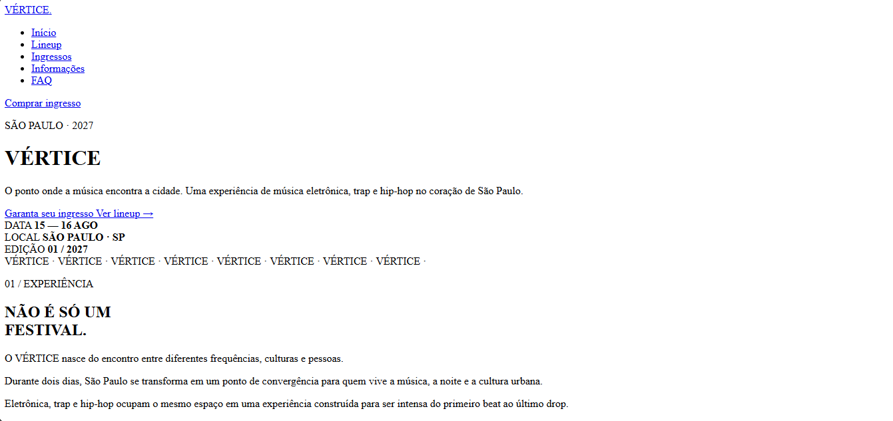
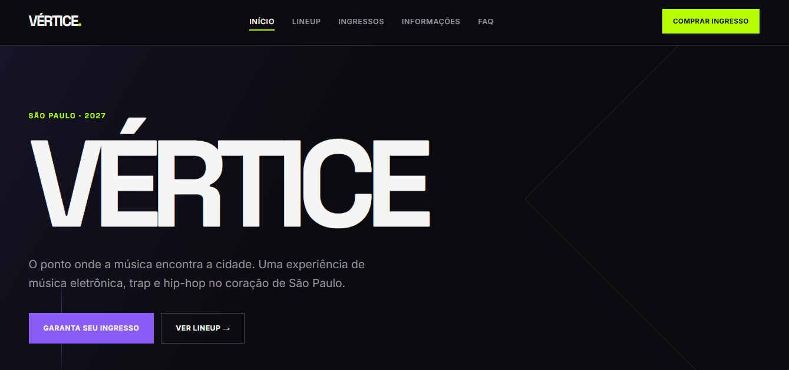

Gere o arquivo **README.md completo** para o projeto VÉRTICE Festival.

Use exatamente esta estrutura:

# VÉRTICE Festival

**Dupla:** Eduardo Balbino Valença e Leonardo Mendes

**Site publicado:** [COLOCAR LINK DA VERCEL DEPOIS]

## Briefing

### Público

Descreva um público de aproximadamente 16 a 30 anos interessado em música eletrônica, trap e hip-hop, que procura uma experiência musical intensa, moderna e visualmente marcante.

### Clima

* Noturno
* Industrial
* Energético

### Paleta de cores

| Cor           | Hexadecimal | Uso                 |
| ------------- | ----------- | ------------------- |
| Preto         | #0B0B0F     | Fundo principal     |
| Roxo elétrico | #8B5CF6     | Destaques e botões  |
| Verde-limão   | #B7FF00     | Chamadas e detalhes |
| Branco        | #F5F5F5     | Textos principais   |
| Cinza         | #202027     | Cards e superfícies |

### Tipografia

**Space Grotesk:** utilizada nos títulos por ter aparência moderna, geométrica e marcante.

**Inter:** utilizada nos textos por ser simples e fácil de ler.

### Referências visuais

Inclua 3 sites reais como referências de design e explique brevemente o que foi observado em cada um.

Use como referências:

1. https://www.awwwards.com/ — inspiração para composição e apresentação visual.
2. https://www.coachella.com/ — inspiração para identidade visual de festival e organização de informações.
3. https://www.sonarfestival.com/ — inspiração para estética de festival de música eletrônica.

## Antes e depois

Explique brevemente que a primeira versão foi gerada com IA e posteriormente refinada por meio de novos prompts.

## Os 4 prompts que mais fizeram diferença

1. "Aumente o impacto visual da página inicial, criando uma seção hero mais alta e com contraste maior."

2. "Faça os cards das atrações parecerem mais industriais, usando bordas, sombras sutis e elementos geométricos."

3. "Melhore a hierarquia visual dos títulos e informações de data e local."

4. "Adicione responsividade para telas menores sem alterar a identidade visual."

## Tecnologias utilizadas

* HTML5
* CSS3
* Google Fonts
* Inteligência Artificial
* GitHub
* Vercel

## Estrutura do projeto

Explique brevemente a função de:

* index.html
* lineup.html
* ingressos.html
* informacoes.html
* faq.html
* style.css
* README.md
* img/

Regras:

* gere somente o conteúdo completo do `README.md`
* use Markdown válido
* não invente o link da Vercel
* mantenha `[COLOCAR LINK DA VERCEL DEPOIS]` como marcador
* mantenha `[NOME 1]` e `[NOME 2]` como marcadores
